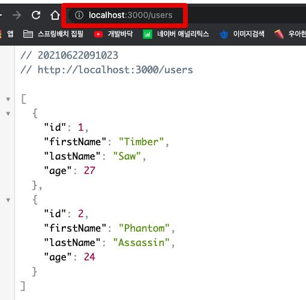
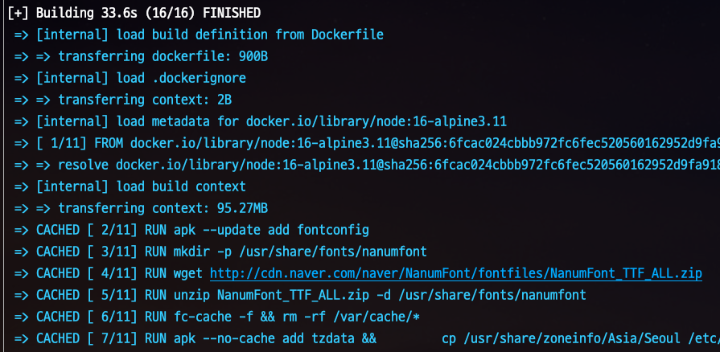
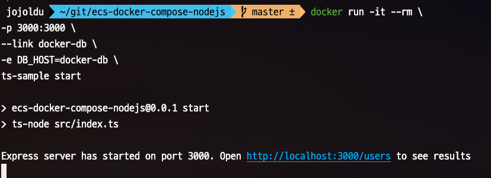
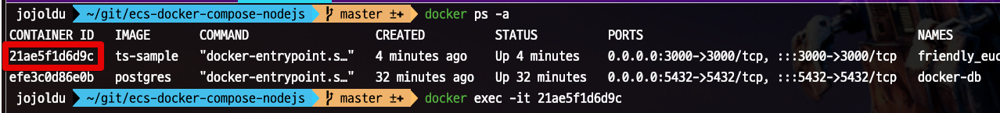
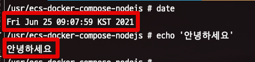
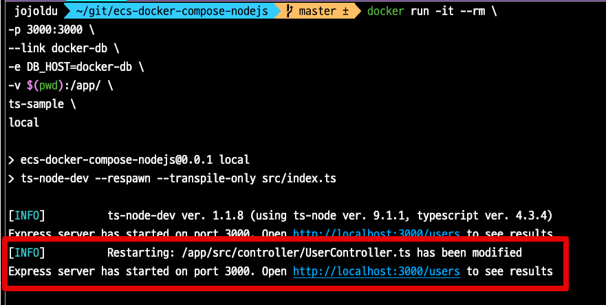

# 1. Docker Compose로 Nodejs 개발/배포환경 구성하기 - Dockerfile로 구성하기 

NodeJS와 같은 스크립트 언어에서는 개발환경을 구성하고, 이를 팀으로 확대하는데 많은 어려움이 있는데요.  
일반적으로는 다음과 같은 문제점들이 있습니다.

* 로컬 PC의 Node버전을 매번 프로젝트 환경에 맞춰 변경해야한다. 
* 때때로 패키지 설치가 막힌다.
* 로컬 컴퓨터에 이미 존재하는 환경과 꼬였다.
* 막상 배포를 했더니 개발 환경과 서버 환경이 같지 않아서 문제가 발생했다.
* 프로젝트에 새로운 사람이 합류하면 그 사람의 개발 환경에 따른 문제점이 발생한다.

그래서 이런 문제점들을 Docker Compose를 통해 개선하고 실제 배포까지 한번 진행해보겠습니다.


> 이 컨텐츠는 인프런 강의인 [도커 쓸 땐 필수! 도커 컴포즈](https://www.inflearn.com/course/%EB%8F%84%EC%BB%A4-%EC%BB%B4%ED%8F%AC%EC%A6%88?inst=9acd6a2e) 에서 많은 영감을 얻었습니다.  
> 강의 제작자이신 [너굴](https://www.facebook.com/raccoonyy) 님의 허가하에 작성하였음을 먼저 말씀드립니다.

## 1. 기본환경 구성

샘플로 진행할 프로젝트의 스택은 다음과 같이 구성됩니다.

* Typescript
* TypeORM
* Express
* PostgreSQL

### 1-1. 프로젝트 구성

위와 같은 환경을 가장 편하게 구성하는 방법은 `typeorm` CLI를 사용하는 것입니다.  

> 아직 `typeorm` CLI 설치가 안되어있으시면 `npm install -g typeorm` 으로 전역 설치를 진행하시면 됩니다.

```bash
typeorm init --name ecs-docker-compose-nodejs --database pg --express
```

설치 후 혹시나 `pg` 설치가 제대로 안된다면 다음과 같이 `pg`만 설치를 진행합니다.

```bash
npm install pg --save
```

그럼 아래와 같이 프로젝트가 구성 됩니다. 

```bash
📦 ecs-docker-compose-nodejs
├─ .gitignore
├─ ormconfig.json
├─ package-lock.json
├─ package.json
├─ src
│  ├─ controller
│  │  └─ UserController.ts
│  ├─ entity
│  │  └─ User.ts
│  ├─ index.ts
│  └─ routes.ts
└─ tsconfig.json
```

기본 프로젝트 구성이 끝났으니, 테스트로 연결해볼 DB를 실행해보겠습니다.

### 1-2. DB 실행

PostgreSQL DB를 Docker로 실행하기 위해 아래와 같이 명령어를 실행합니다.

```bash
docker run --rm \
--name docker-db \
-e POSTGRES_DB=test \
-e POSTGRES_USER=test \
-e POSTGRES_PASSWORD=test \
-p 5432:5432 \
postgres
```

* DB의 name은 `docker-db`
* 나머지 접속 정보(`DB`, `USER`, `PASSWORD`) 는 모두 `test`를 사용합니다.

이렇게 실행된 PostgreSQL DB와 1-1. 에서 만든 프로젝트를 연결해보겠습니다.  
먼저 `ormconfig.json` 에 아래의 내용을 추가합니다.

> 저는 `json` 보다는 `js`를 선호해서 `ormconfig.json`을 `ormconfig.js`로 전환해서 사용합니다.

```javascript
module.exports = {
   "type": "postgres",
   "host": test,
   "port": 5432,
   "username": "test",
   "password": "test",
   "database": "test",
   ...
}
```

해당 설정 후, 프로젝트를 실행하시면 다음과 같은 로그가 정상적으로 나와야 합니다.

```bash
Express server has started on port 3000. Open http://localhost:3000/users to see results
```
브라우저를 확인해보시면 다음과 같이 데이터를 볼 수 있습니다.



여기까지는 일반적인 로컬 개발환경에 대한 내용입니다.  
로컬 PC에 직접 프로젝트를 구성하고, DB / Redis / Queue 등은 Docker를 통해 설치해서 개발환경을 구성하는 것이죠.  
  
하지만 도입부에서 언급했듯이 이럴 경우 다음과 같은 문제를 여전히 해결이 안됩니다.

* 로컬 PC의 Node버전을 매번 프로젝트 환경에 맞춰 변경해야한다. 
* 때때로 패키지 설치가 막힌다.
* 로컬 컴퓨터에 이미 존재하는 환경과 꼬였다.
* 막상 배포를 했더니 개발 환경과 서버 환경이 같지 않아서 문제가 발생했다.
* 프로젝트에 새로운 사람이 합류하면 그 사람의 개발 환경에 따른 문제점이 발생한다.

그래서 로컬 PC에 직접 구축한 프로젝트 역시 Docker로 전환해보겠습니다.

## 2. Dockerfile로 개발환경 구성하기

### 2-1. Dockerfile 생성하기

현재의 Node 프로젝트를 위한 `Dockerfile` 은 다음과 같이 구성됩니다.  
  
**Dockerfile**

```dockerfile
FROM node:16-alpine3.11

# Korean Fonts
RUN apk --update add fontconfig
RUN mkdir -p /usr/share/fonts/nanumfont
RUN wget http://cdn.naver.com/naver/NanumFont/fontfiles/NanumFont_TTF_ALL.zip
RUN unzip NanumFont_TTF_ALL.zip -d /usr/share/fonts/nanumfont
RUN fc-cache -f && rm -rf /var/cache/*

# Language
ENV LANG=ko_KR.UTF-8 \
    LANGUAGE=ko_KR.UTF-8

# Set the timezone in docker
RUN apk --no-cache add tzdata && \
        cp /usr/share/zoneinfo/Asia/Seoul /etc/localtime && \
        echo "Asia/Seoul" > /etc/timezone

# Create Directory for the Container
WORKDIR /app

# Only copy the package.json file to work directory
COPY package.json .
RUN npm install

# Copy all other source code to work directory
COPY . .

# Docker Demon Port Mapping
EXPOSE 3000

# Node ENV
ENV NODE_ENV=production

# RUN local or production (or dev)
ENTRYPOINT ["npm", "run"]
```

대부분의 command는 주석과 함께 보시면 이해가 가능하실 것 같습니다.

* `FROM node:16-alpine3.11` 
  * Node 16버전이 설치된 [알파인 리눅스(Alpine Linux)](https://www.lesstif.com/docker/alpine-linux-35356819.html) 을 사용합니다.
  * 알파인 리눅스는 `apt` 혹은 `yum` 으로 패키지를 관리하지 않고 `apk`를 통해 관리합니다.
* `CMD [ "npm", "run" ]`
  * `CMD`는 다른 command와 다르게 빌드할때 수행되지 않고, **이미지를 실행할때** 수행됩니다.
  * 즉, 위 Dockerfile로 만든 이미지를 `docker run` 할때 `CMD`가 수행되는데요.
  * `npm start` 로만 되어있기 때문에 `docker run`을 수행할때 `start` 혹은 `dev` 등을 추가 인자로 등록하면 `npm run start` 혹은 `npm run dev` 로 실행시킬 수 있게 됩니다.

이렇게 만든 Dockerfile을 빌드해봅니다.

```bash
docker build -t ts-sample .
```

그럼 아래와 같이 로그가 보이면서 빌드가 진행되는데요.



완료가 되면 이제 이 프로젝트를 Docker로 실행할 수 있게 됩니다.  
  
```bash
docker run -it --rm \
-p 3000:3000 \
--link docker-db \
ts-sample \
start
```

* `--link docker-db`
  * 1-2 에서 실행된 `--name docker-db` 의 DB와 연결합니다.
* `ts-sample`
  * `docker build` 로 만든 `ts-sample`을 실행합니다.
* `start`
  * Dockerfile에 선언된 `ENTRYPOINT` 에서 `npm`, `run` 다음 인자로 사용됩니다.
  * 합쳐서 `npm run start`로 Docker 가 실행시 명령어가 실행됩니다.


위 명령어를 실행해보시면?  
아래와 같이 **Connection 오류**가 발생합니다.

```bash
Error: connect ECONNREFUSED 127.0.0.1:5432
    at TCPConnectWrap.afterConnect [as oncomplete] (node:net:1133:16) {
  errno: -111,
  code: 'ECONNREFUSED',
  syscall: 'connect',
  address: '127.0.0.1',
  port: 5432
}
```

에러 로그에 나와있듯이 이는 접근하고자 하는 DB의 주소가 localhost (127.0.0.1) 이기 때문입니다.  
Docker 입장에서 localhost는 내 PC일까요?  
당연하게도 Docker 내부가 localhost 이기 때문에 현재 `ts-sample` Docker 컨테이너 내부에서 PostgreSQL DB를 찾으려했지만 찾지 못하여 발생한 것입니다.  
  
이를 해결하려면 DB의 접속 주소를 **link된 DB**로 인식할 수 있도록 코드 변경이 필요합니다.

### 2-2. 다른 Docker의 DB와 연결하기

먼저 현재 실행중인 `ts-sample` Docker를 종료하고, 아래와 같이 **ormconfig**파일을 수정합니다.  
  
**ormconfig.js**

```javascript
module.exports = {
   ...
   "host": process.env.DB_HOST,
   ...
}
```

* 기존의 `localhost` 였던 `host`를 **환경변수**를 사용하도록 변경하였습니다.  

자 이렇게 변경후 다시 Docker Build를 수행합니다.

```bash
docker build -t ts-sample .
```

그리고 이번에는 **환경변수를 추가**하여서 `run` 해봅니다.

```bash
docker run -it --rm \
-p 3000:3000 \
--link docker-db \
-e DB_HOST=docker-db \
ts-sample \
start
```

* `-e DB_HOST=docker-db`
  * 환경변수 `DB_HOST`에 `docker-db`를 등록합니다.

그럼 아래와 같이 정상적으로 DB가 접근 되는 것을 볼 수 있습니다.



> 만약 현재 실행중인 DB Docker의 데이터가 계속 유지되길 원하신다면 [도커 컴포즈를 활용하여 완벽한 개발 환경 구성하기](https://www.44bits.io/ko/post/almost-perfect-development-environment-with-docker-and-docker-compose#%EB%8D%B0%EC%9D%B4%ED%84%B0%EB%B2%A0%EC%9D%B4%EC%8A%A4-%EB%8D%B0%EC%9D%B4%ED%84%B0%EB%A5%BC-%EB%B3%B4%EC%A1%B4%ED%95%98%EA%B8%B0) 를 참고해보세요.

### 2-3. Docker 컨테이너 접속

실행된 Docker 컨테이너에 들어가서 설정한 여러 옵션들이 잘 적용되었는지도 한번 체크해봅니다.  
  
먼저 현재 접속 중이 Docker Process를 확인해봅니다.

```bash
docker ps -a
```

실행중인 앱 컨테이너의 ID를 확인후



아래 명령어로 접속해봅니다.

```bash
docker exec -it 21ae5f1d6d9c sh
```

접속되셨다면 아래 명령어로 현재 디렉토리와 **프로젝트의 모든 파일이 동일하게 구성**되었는지 봅니다.

```bash
ls -al
```

**KST**와 **한글폰트**도 잘 적용되었는지 확인해봅니다.



자 여기까지 오면서 한가지 불편한게 느껴지셨을텐데요.  
**코드가 변경될때마다 Docker build를 수행해야하나**? 라는 생각이 듭니다.  
  
그래서 이 부분 역시 개선해보겠습니다.

### 2-4. 실시간 코드 반영하기

개선의 방법은 다음과 같습니다.  

* 수정할 JS 파일들의 디렉터리를 앱 컨테이너 내부의 소스 코드와 연결하여, 코드를 바꿀 때마다 컨테이너 속 코드도 바뀌게 됩니다.  

docker run 명령어에 아래의 값이 추가됩니다.

```bash
-v $(pwd):/app/ 
```

* `-v`, `--volume`
    * host의 file system과 container의 파일 시스템이 연결됩니다.
    * ex) `호스트 디렉토리 위치:컨테이너 디렉토리 위치`

그리고 실시간으로 TypeScript 파일의 변경에 맞춰 Express APP의 재실행과 TS Compile을 할 수 있도록 [ts-node-dev](https://www.npmjs.com/package/ts-node-dev) 도 적용합니다.

```bash
npm i ts-node-dev --save-dev
```

**package.json**

```json
"scripts": {
  "start": "ts-node src/index.ts",
  "local": "ts-node-dev src/index.ts"
}
```

자 그래서 최종적으로 Docker run 명령어는 다음과 같습니다.

```bash
docker run -it --rm \
-p 3000:3000 \
--link docker-db \
-e DB_HOST=docker-db \
-v $(pwd):/app/ \
ts-sample \
local
```



> 현재 (2021.07.03) 위 방법으로 진행할 경우 Docker 내에서는 `ts-node-dev`의 restart가 로컬PC에서 몇배는 더 느립니다.  
> 로컬 PC에서는 1초 이내에 restart가 되는데, Docker 내에서는 restart시에 5~7초는 걸리기 때문에 이 이슈가 해결되면 별도로 다시 포스팅하겠습니다. 

## 3. 마무리

다들 도커가 좋다고는 얘기해서 도커로 개발환경을 한번 구성해보았는데, **이게 정말 좋은게 맞나?**라는 생각이 드실텐데요.  
  
여기까지 하면서 다음과 같은 불편함이 느껴지신다면 정확하게 느끼신겁니다.

* 각 도커 실행 옵션들을 모두 기억 (혹은 기록)해서 실행해야함
* DB / Redis 등을 항상 앱 보다 먼저 실행해야함 (순서보장)
  * 앱을 먼저 실행하면 접속 가능한 DB/Redis가 없어서 실행 실패

자 그래서 바로 이런 불편함을 해결해줄 **도커 컴포즈**로 개발환경 개선을 다음 시간에 이어서 진행해보겠습니다.


