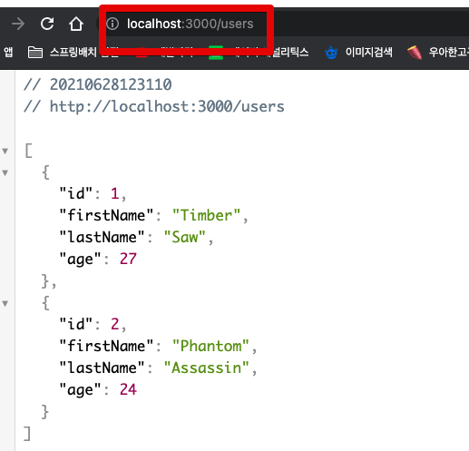

# 1. Docker Compose & AWS ECS로 Nodejs 개발/배포환경 구성하기

NodeJS와 같은 

## 1. 기본환경 구성

기본적인 환경은 `typeorm` 을 통해 생성할 예정입니다.  


```bash
typeorm init --name ecs-docker-compose-nodejs --database pg --express
```

```bash
npm install pg --save
```

## DB 실행

```bash
docker run --rm \
--name docker-db \
-e POSTGRES_DB=test \
-e POSTGRES_USER=test \
-e POSTGRES_PASSWORD=test \
-p 5432:5432 \
postgres
```

## Dockerfile

```bash
docker build -t ts-sample .
```

* [알파인 리눅스(Alpine Linux)](https://www.lesstif.com/docker/alpine-linux-35356819.html)

## DB 연결

**ormconfig.js**

```javascript
module.exports = {
   "type": "postgres",
   "host": process.env.DB_HOST,
   "port": 5432,
   "username": "test",
   "password": "test",
   "database": "test",
   "synchronize": true,
   "logging": false,
   "entities": [
      "src/entity/**/*.ts"
   ],
   "migrations": [
      "src/migration/**/*.ts"
   ],
   "subscribers": [
      "src/subscriber/**/*.ts"
   ],
   "cli": {
      "entitiesDir": "src/entity",
      "migrationsDir": "src/migration",
      "subscribersDir": "src/subscriber"
   }
}
```

```bash
docker run -it --rm \
-p 3000:3000 \
--link docker-db \
-e DB_HOST=docker-db \
ts-sample
```

그럼 아래와 같이 
```bash
> ecs-docker-compose-nodejs@0.0.1 start
> ts-node src/index.ts

Express server has started on port 3000. Open http://localhost:3000/users to see results
```



## 실시간 코드 반영

```bash
docker ps -a
```


```bash
docker exec -it 21ae5f1d6d9c sh
```

```bash
ls -al
```

```bash 
drwxr-xr-x    1 root     root          4096 Jun 24 09:28 .
drwxr-xr-x    1 root     root          4096 Jun 23 09:44 ..
drwxr-xr-x    7 root     root          4096 Jun 24 09:28 .git
-rw-r--r--    1 root     root            47 Jun 21 11:35 .gitignore
drwxr-xr-x    2 root     root          4096 Jun 24 09:28 .idea
-rw-r--r--    1 root     root           843 Jun 23 09:47 Dockerfile
-rw-r--r--    1 root     root            37 Jun 22 09:31 README.md
-rw-r--r--    1 root     root           650 Jun 21 11:53 docker-compose.yml
drwxr-xr-x    1 root     root          4096 Jun 23 09:38 node_modules
-rw-r--r--    1 root     root           502 Jun 24 09:22 ormconfig.js
-rw-r--r--    1 root     root        120900 Jun 21 11:58 package-lock.json
-rw-r--r--    1 root     root           478 Jun 21 11:58 package.json
drwxr-xr-x    5 root     root          4096 Jun 23 09:38 posts
drwxr-xr-x    5 root     root          4096 Jun 23 09:38 src
-rw-r--r--    1 root     root           298 Jun 21 11:35 tsconfig.json
```

KST와 한글폰트도 잘 적용되었는지 확인해봅니다.


### 자동 재실행

Nodemon 적용
```bash

```

```bash
docker run -it --rm \
-p 3000:3000 \
--link docker-db \
-e DB_HOST=docker-db \
-v $(pwd):/app/ \
ts-sample
```

* `-v`, `--volume`
    * host의 file system과 container의 파일 시스템이 연결됩니다
    * `/host/some/where:/container/some/where`

