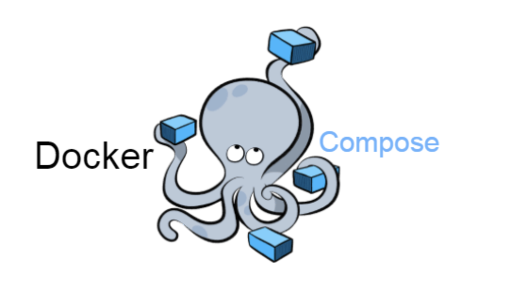
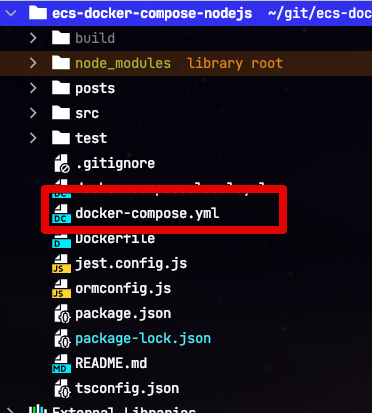
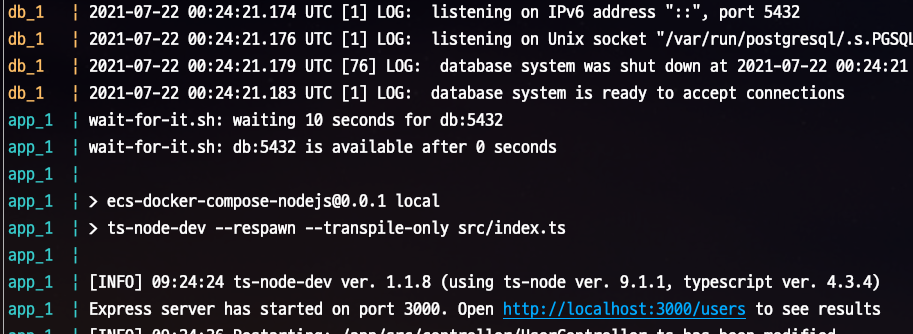

# 2. Docker Compose로 Nodejs 개발/배포환경 구성하기 - Docker Compose로 개선하기

[앞서 진행된 과정](https://jojoldu.tistory.com/584) 을 통해 **Docker를 통한 독립적인 환경의 장점**은 알게 되었지만, 반면에 직접 하나하나 CLI를 입력하여 Docker를 수행하는것의 불편함도 알게 되었습니다.  
  
이런 불편함을 겪은건 비단 저희만 그런것은 아니겠죠?  
이미 이런 불편함을 해결 하기 위해 [도커 컴포즈](https://docs.docker.com/compose/)가 출시 되었습니다.  


  
도커 컴포즈는 여러 Docker 애플리케이션을 정의하고 실행하기 위한 도구입니다.  
이를 활용하면 그동안 저희가 수행했던 CLI 명령어 옵션이나 컨테이너 간 실행 순서등을 파일로서 관리할 수 있게 됩니다.  
  
이 파일로 관리한다는 점이 가지는 또 하나의 장점은, 바로 **버전 관리**가 된다는 것인데요.  
도커 컴포즈를 구성하는 `docker-compose.yml` 파일에 작성된 내용은 프로젝트 Git으로 관리되고 있어, 언제든 이전 내용으로 롤백이나, 변경 내역등을 확인해볼 수 있습니다.  
  
CLI 방식에 비해 월등하게 장점이 많기 때문에 사용하지 않을 이유가 전혀 없습니다.  
  
자 그럼 이제 한번 본격적으로 도커 컴포즈를 사용해보겠습니다.

> 이후의 과정을 따라하려면, 도커 엔진의 버전이 1.13.1 이상이어야 하고, 도커 컴포즈의 버전은 1.6.0 이상이어야 합니다.  
> 최근 (2021.07.19) 도커를 설치했다면 큰 문제가 없습니다.

## 1. docker-compose.yml 생성하기

프로젝트 root에서 docker-compose.yml 파일을 생성합니다.



작성할 내용은 다음과 같습니다.

```yml
version: '3.8'

services:
  db:
    image: postgres
    environment:
      - POSTGRES_DB=test
      - POSTGRES_USER=test
      - POSTGRES_PASSWORD=test
      - POSTGRES_INITDB_ARGS=--encoding=UTF-8

  app:
    build:
      context: .
      dockerfile: ./Dockerfile
    environment:
      - DB_HOST=db
      - DB_PORT=5432
      - DB_NAME=test
      - DB_USERNAME=test
      - DB_PASSWORD=test
    depends_on:
      - db
    ports:
      - "3000:3000"
    command:
      - npm run local
    volumes:
      - ./:/app/
```

* `version: 3.8`
  * compose 파일 버전을 명시합니다.
    * 저는 3버전대의 최신인 3.8을 사용했습니다.
  * `3`으로 작성하게 되면 **3.0**으로 해석하게 됩니다.
    * 과거에는 `3`으로 작성하면 3 버전대의 최신버전을 자동으로 매핑해주었지만, 이제는 메이저버전만 명시할 경우 [자동으로 마이너 버저닝은](https://docs.docker.com/compose/compose-file/compose-versioning/#version-3) `0` 이 됩니다.
  * 좀 더 자세한 내용은 [공식 문서](https://docs.docker.com/compose/compose-file/compose-versioning/)를 참고하시면 됩니다.
* `services`
  * 컴포즈로 관리할 컨테이너들을 명시합니다.
  * 지칭하는 용어만 다릅니다 (컴포즈에서는 컨테이너 대신 서비스라고 합니다.)
  * `services:db`, `services:app`
    * 각 서비스 (컨테이너)의 별칭을 나타냅니다.
    * **명시한 순서대로 실행**됩니다.
    * 즉, `db`가 실행되고 이후에 `app`이 실행되어 `db`에 대한 `app` 실행 순서를 지킬 수 있습니다.

각 Service (`db`, `app`)의 옵션은 다음과 같습니다.

### 1-1. db 서비스 설정

* `image`
  * 서비스에서 사용할 도커 이미지를 선택합니다.
  * `postgres` 는 [도커 공식 PostgreSQL 이미지](https://hub.docker.com/_/postgres/) 입니다.
* `environment`
  * `docker run` 실행시 -e 옵션에 적었던 환경변수들입니다.  
  * 마지막의 POSTGRES_INITDB_ARGS 부분이 추가되었는데, 데이터베이스 서버의 인코딩을 UTF-8로 설정하기 위함입니다.

### 1-2. app 서비스 설정

* `build`
  * DB와 같이 이미지를 사용하는 것이 아니기 때문에 `build`를 사용합니다.
  * `docker build` 명령어를 수행합니다.
  * `context`
    * `docker build` 를 실행할 디렉토리입니다.
    * `.`로 했기 때문에 현재 위치가 됩니다.
  * `dockerfile`
    * 빌드에 사용될 Dockerfile을 선택합니다.
* `depends_on`
  * 특정 서비스에 대한 의존도를 나타냅니다.
    * 지정된 서비스가 먼저 시작되도록 합니다.
  * `depends_on`에는 큰 이슈가 하나 있습니다. 
    * PostgreSQL가 완전히 실행되고 준비될때까지 `app`이 기다려야하는데, **PostgreSQL 실행 명령어만 수행되면 바로** `app` **이 수행**되기 때문에 종종 DB를 찾을 수 없다는 메세지가 발생하게 됩니다.
    * 때문에 [wait-for-it](https://github.com/vishnubob/wait-for-it/)등을 통해 [특정 서버의 특정 포트로 접근할 수 있을 때까지 기다린 뒤](https://docs.docker.com/compose/startup-order/)에 `app`이 수행되어야만 합니다.
    * 아래에서 좀 더 자세하게 설정 방법을 소개 드립니다. 
* `ports`
  * 외부 포트와 컨테이너내 포트를 연결합니다.
  * `docker run` 명령어의 `-p` 옵션과 동일합니다.
* `command`
  * `docker run` 의 마지막 명령어와 동일합니다.
  * 여기서는 마지막에 입력된 `npm run local`를 등록합니다.
* `volumes`
  * 로컬 PC의 디렉토리와 컨테이너 안의 디렉토리를 연결합니다.
  * [이전 시간](https://jojoldu.tistory.com/584)에 진행된 실시간 코드 반영하기에서 사용된 `-v` (`--volume`) 옵션과 동일합니다. 

위 내용을 보시면 한가지 누락된 옵션이 있는 것이 보이실텐데요.  
기존에 사용하던 `docker run`의 `--link` 옵션이 없습니다.    
해당 옵션은 다른 컨테이너와의 연결을 해주는 옵션이였는데요.  
도커 컴포즈에서는 `--link` 가 없더라도, 동일한 `docker-compose.yml` 에 속해있는 service들은 서로 통신할 수 있도록 지원합니다.  
  
그래서 도커 컴포즈를 이용하실 경우, `--link` 옵션은 전혀 사용하실 필요가 없습니다.

### 1-3. depends_on 완전 실행 대기

위에서도 언급했지만, (**로컬 개발환경에 한해서**) Node 애플리케이션이 실행되기 전에 DB가 완전히 실행완료 되어야하는 것에 대해 보장이 필요합니다.

* [depends_on 공식문서](https://docs.docker.com/compose/compose-file/compose-file-v3/#depends_on)
* [docker compose startup-order 공식문서](https://docs.docker.com/compose/startup-order/)

이를 해결하는 가장 보편적인 방법은 [wait-for-it.sh](https://github.com/vishnubob/wait-for-it) 스크립트를 사용하는 것입니다.  
이름이 알려주듯 **특정 서버의 특정 포트로 접근할 수 있을 때까지 기다려주는** 스크립트입니다.  
이 스크립트를 도커 이미지 안에 넣고, 이미지 실행 명령 앞에 붙여주면 됩니다.

(1) 현재 디렉토리에 해당 파일을 다운 받아 저장합니다.

```bash
wget https://raw.githubusercontent.com/vishnubob/wait-for-it/master/wait-for-it.sh
```

(Windows 환경이신분들은 직접 위 링크를 다운받으시면 됩니다.)  
  
위 링크 다운로드를 Docker 이미지안에서 진행해도 됩니다.

```bash
ADD    https://raw.githubusercontent.com/vishnubob/wait-for-it/master/wait-for-it.sh /
```

다만, 이럴 경우 **Github이 다운되면 배포 자체가 불가능해지니**, 마음편하게 한번만 다운받아서 계속 쓸 수 있도록 하는 방법을 선호합니다.  
  
(2) Dockerfile 파일 하단에 다음 내용을 추가합니다.

```bash
# wait-for-it.sh
COPY wait-for-it.sh ./
RUN chmod +x wait-for-it.sh
```

(3) docker-compose.yml 의 `command` 를 아래와 같이 수정합니다.

```yml
command:
  - bash
  - -c
  - |
    /app/wait-for-it.sh db:5432 -t 10
    npm run local
```

이렇게 해서 전체 코드는 다음과 같습니다.  
  
**Dockerfile**

```bash
FROM node:16-alpine3.11

# Korean Fonts
RUN apk --update add fontconfig
RUN mkdir -p /usr/share/fonts/nanumfont
RUN wget http://cdn.naver.com/naver/NanumFont/fontfiles/NanumFont_TTF_ALL.zip
RUN unzip NanumFont_TTF_ALL.zip -d /usr/share/fonts/nanumfont
RUN fc-cache -f && rm -rf /var/cache/*

# bash install
RUN apk add bash

# Language
ENV LANG=ko_KR.UTF-8 \
    LANGUAGE=ko_KR.UTF-8

# Set the timezone in docker
RUN apk --no-cache add tzdata && \
        cp /usr/share/zoneinfo/Asia/Seoul /etc/localtime && \
        echo "Asia/Seoul" > /etc/timezone

# Create Directory for the Container
WORKDIR /app

# Only copy the package.json file to work directory
COPY package*.json ./
RUN npm install

# wait-for-it.sh
COPY wait-for-it.sh ./
RUN chmod +x wait-for-it.sh

# Docker Demon Port Mapping
EXPOSE 3000

# Node ENV
ENV NODE_ENV=production
```

**docker-compose.yml**

```yaml
version: '3.8'

services:
  db:
    image: postgres
    environment:
      - POSTGRES_DB=test
      - POSTGRES_USER=test
      - POSTGRES_PASSWORD=test
      - POSTGRES_INITDB_ARGS=--encoding=UTF-8

  app:
    build:
      context: .
      dockerfile: ./Dockerfile
    environment:
      - DB_HOST=db
      - DB_PORT=5432
      - DB_NAME=test
      - DB_USERNAME=test
      - DB_PASSWORD=test
    depends_on:
      - db
    ports:
      - "3000:3000"
    command:
      - bash
      - -c
      - |
        /app/wait-for-it.sh db:5432 -t 10
        npm run local
    volumes:
      - ./:/app/

```

이제 모든 준비가 되었습니다!

## 2. 실행

자 여기까지 하셨으면 한번 도커 컴포즈로 프로젝트를 실행해보겠습니다.

```bash
docker-compose up --build
```

그럼 아래와 같이 DB와 APP이 모두 실행 완료가 되면 성공입니다!



## 3. 도커 컴포즈 명령어

도커 컴포즈에서는 다양한 명령어들이 있습니다.  

### 도움말

제일 먼저 확인해볼 것은 `help` 입니다.

```bash
docker-compose help
```

사용시에 아래와 같이 각종 명령어에 대한 설명을 볼 수 있습니다.

```bash
Commands:
  build              Build or rebuild services
  config             Validate and view the Compose file
  create             Create services
  down               Stop and remove resources
  events             Receive real time events from containers
  ...
```

### 실행

컨테이너 이미지 다운로드, 빌드, 네트워크 설정 등 `docker-compose.yml`에 맞춰 서비스 환경을 구성하고 실행합니다.

```bash
docker-compose up
```

여기서 아래와 같이 `-d` 옵션을 추가할 경우 **백그라운드** 실행이 가능합니다.  

```bash
docker-compose up -d
```

만약 **Dockerfile도 변경되어서 이미지 생성부터 다시해아한다면** `--build`를 사용하면 됩니다.

```bash
docker-compose up -d --build
```

### 서비스 초기화

컨테이너/네트워크/서비스 등을 지웁니다.

```bash
docker-compose down
```

* `--volume`
  * 위 옵션을 추가하면 볼륨까지 삭제합니다.


### 서비스 실행/종료

한번 구축된 서비스를 실행/종료 합니다.

```bash
docker-compose stop
docker-compose start
```

이 둘을 합친 `restart` 옵션도 사용할 수 있습니다.

```bash
docker-compose restart
```

### 상태 확인

현재 환경에서 도커 컴포즈로 실행된 서비스들의 상태를 보여줍니다.

```bash
docker-compose ps -a
```

실행하시면 다음과 같은 결과를 볼 수 있습니다.
```bash
   Name                  Command                State     Ports
---------------------------------------------------------------
nodejs_app_1   docker-entrypoint.sh bash  ...   Exit 137        
nodejs_db_1    docker-entrypoint.sh postgres    Exit 137  
```

이 외에 다양한 옵션들과 상세한 설명들은 [공식 문서](https://docs.docker.com/compose/reference/up/)를 통해 확인할 수 있습니다.

## 4. 마무리

자 여기까지 도커 컴포즈를 통한 개발환경까지 구축했습니다.  
다음 시간에는 이 도커와 컴포즈를 통해 **AWS의 ECS 배포**까지 진행해보겠습니다.
